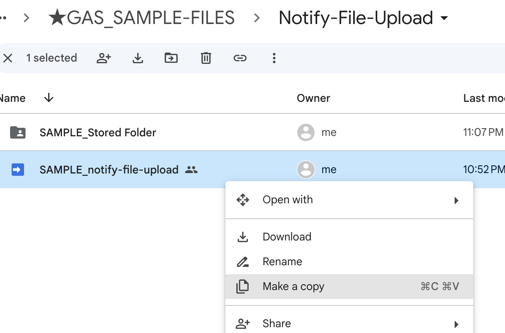
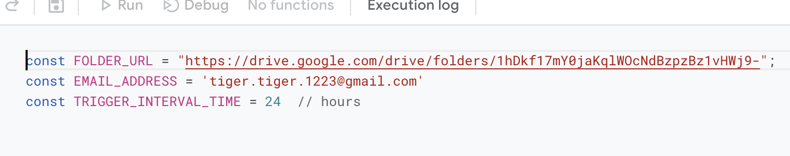
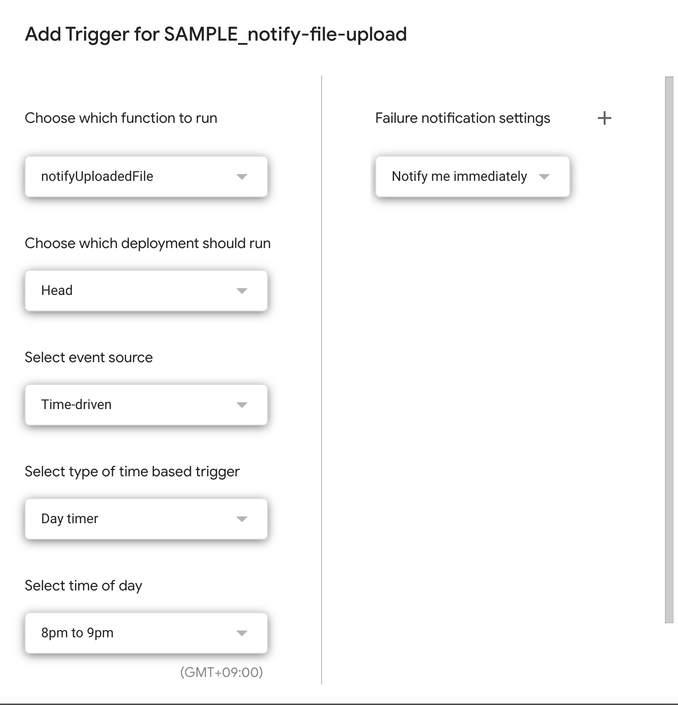
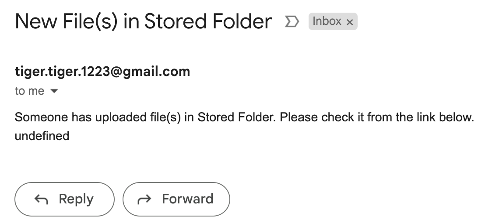

## About this Project

This project involves a Google Apps Script that monitors a specified Google Drive folder for new file uploads. When a new file is uploaded, the script calculates the time since the last upload and, if this falls within a predefined interval, sends a notification email.

- The script is useful for keeping track of updates in shared Google Drive folders.

## Prerequisites

- A Google account with access to Google Drive.
- Basic understanding of Google Apps Script.
- Familiarity with JavaScript and regular expressions is beneficial.

## Setup

1. **Open Your Google Sheet**: Access <a href="https://drive.google.com/drive/folders/16WEoOo_bTAKJSM6HAPCdPQj64cfeZCvt" target="_blank" rel="noopener noreferrer">Sample Google Drive Folder</a>.

2. **Copy the Sample Google Apps Script**: Copy the sample script, which is automatically stored in your `My Drive`.

   {: .resize-image}

3. Set the constant variables (folder url/ email address/ interval) in `variables.gs`.

   {: .resize-image}

4. **Set Trigger**: Set the trigger for the script to run periodically.
  - You can set the trigger in your preferred way.

    {: .resize-image}

5. **Upload a File to the Folder**: Upload a file to the folder to test the script.

6. **Run the Script**: Run the script to test the notification email. If you receive the email, the script is working correctly.

   {: .resize-image}

## Usage

1. **Monitoring File Uploads**: The script automatically checks for new file uploads in the designated Google Drive folder.
2. **Receiving Notifications**: If a new file is uploaded within the specified time interval, you'll receive an email notification with details about the file and a link to the folder.

 - You can find logics for new file existence and the notification from HERE [Logic of Notification](https://docs.google.com/presentation/d/1eaOfzJpEgpluX5kBIWKeiQHy_zm3yx5ktHjfPBqo90s/edit#slide=id.p).

## Others

- **Troubleshooting**: Ensure that the folder URL is correctly set in the script and that you have the necessary permissions for the Google Drive folder.
- **Customization**: You can customize the script to change the notification conditions, email format, or to add additional functionalities.

